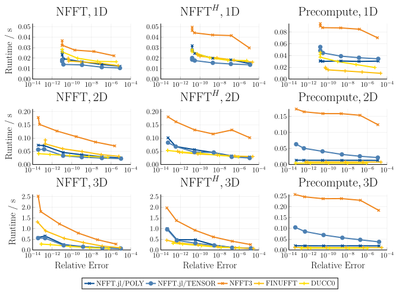

# Accuracy and Performance

On this page, the accuracy and the performance of NFFT.jl are investigated. For comparison we use
the C library NFFT3 and the C++ library FINUFFT. 
The parameters for the benchmark are 
* ``\bm{N}_\text{1D}=(512*512,), \bm{N}_\text{2D}=(512,512), \bm{N}_\text{3D}=(64,64,64)``
* ``J= \vert \bm{N} \vert``
* ``m=3, \dots, 8``
* ``\sigma = 2``
* `POLYNOMIAL` and `TENSOR` precomputation
* 1 thread
* random nodes
All benchmarks are performed with `@belapsed` from [BenchmarkTools.jl](https://github.com/JuliaCI/BenchmarkTools.jl) which takes the minimum of several runs (120 s upper benchmark time). The benchmark is run on a computer with 2 AMD EPYC 7702 CPUs running at 2.0 GHz (256 cores in total) and a main memory of 1024 GB. The benchmark suite is described [here](https://github.com/JuliaMath/NFFT.jl/blob/master/benchmark/Readme.md).

The results for ``D=1,\dots,3`` are shown in the following graphic illustrating the accuracy (x-axis) versus the performance (y-axis) for various ``m``. 

The results show that NFFT.jl one of the fastest NFFT libraries. One can chose between shorter precomputation time using `POLYNOMIAL` precomputation or faster transforms using `TENSOR` precomputation.
